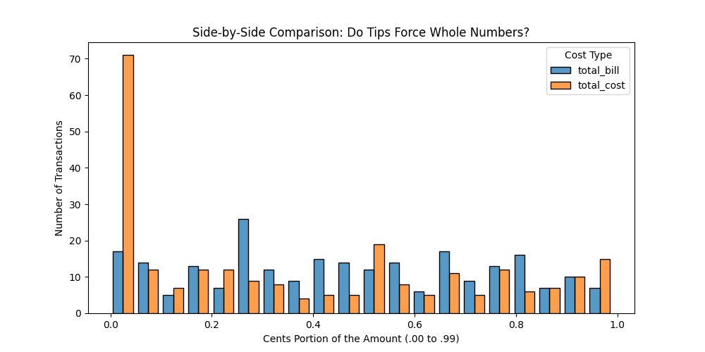

# Data Analytics Fundamentals

This site provides documentation for this project.
Use the navigation to explore module-specific materials.

## Custom Project

### Dataset
"Total bill (cost of the meal), including tax, in US dollars, Tip (gratuity) in US dollars, Sex of person paying for the meal, Smoker in party?, Day of Week, Meal Time" [Description Source](https://www.kaggle.com/datasets/ranjeetjain3/seaborn-tips-dataset)
It's important to note that this dataset was collected in the 1990s, analysis was performed for both the raw data, and the data adjusted for inflation by a factor of 2.55

### Phase 4 Modifications
A different dataset was analyzed, additional data points (like tip percentage, and total cost including tip) were added as values of interest

### Phase 5 Custom Project
Two separate scenarios needed to be explored. The first data passthrough didn't show anything extraordinary or highly interesting. It did show that the majority of customers adjusted their tip so the final bill would be a clean even number. 
Comparing scaled/inflation accounted data isn't meaningful, as the tip percentage remains the same with a standard scaling factor, it is useful however to consider the cost of the meal and tip relevant to today's costs

## How-To Guide

Many instructions are common to all our projects.

See
[⭐ **Workflow: Apply Example**](https://denisecase.github.io/pro-analytics-02/workflow-b-apply-example-project/)
to get these projects running on your machine.

## Project Documentation Pages (docs/)

- **Home** - this documentation landing page
- [**Project Instructions**](./project-instructions.md) - specific to this module
- [**Your Files**](./your-files.md) - how to copy the example and create your version
- [**Glossary**](./glossary.md) - project terms and concepts
- [**API**](./api.md) - autogenerated code documentation for public project interface
   Not easy to read, but useful once you get used to it.
- **Module-specific**
  - [RESOURCES.md](./module/RESOURCES.md)
  - [seaborn-datasets.md](./module/seaborn-datasets.md)
  - [TROUBLESHOOTING.md](./module/TROUBLESHOOTING.md)
